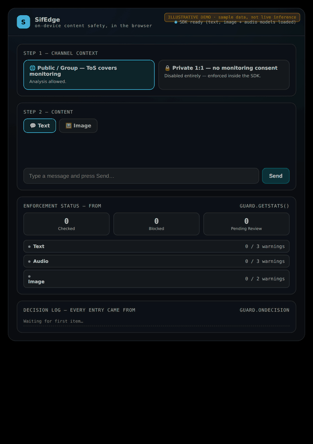

<div align="center">

# SifEdge

**On-device content safety for chat, images, and voice.**

Text, image, and audio moderation that runs entirely in the browser.
No content ever leaves the user's device — only a decision and a hash do.

[](LICENSE)
[](https://github.com/MihaiMotoi/SifEdge/actions/workflows/test.yml)

</div>

---

## See it in action

Type an insult, get an instant `BLOCKED` decision with a score. Drop in an
ordinary photo, get `ALLOWED`. Every check lands in the decision log below,
with a proof hash and the running warning count.



*Illustrative — the UI and flow are real, but this GIF plays back sample
decisions rather than live model output (recording live inference wasn't
possible in the environment this was generated in). Run
[`examples/demo.html`](examples/demo.html) yourself to see the real thing.*

## What it does

SifEdge checks user-generated content for abuse and returns a decision your
platform can act on:

| Input | What's checked | Model |
|---|---|---|
| **Text** | toxicity, insults, threats, hate speech — **15 languages** | multilingual BERT classifier (converted to ONNX, see setup) |
| **Images** | explicit / NSFW content | `onnx-community/nsfw_image_detection-ONNX` |
| **Audio** | *what was said* (transcript → toxicity) **and** *how it was said* (vocal aggression) | `Xenova/whisper-tiny.en` + `wav2vec2` speech-emotion |

Every check returns one of three outcomes:

- **`ALLOWED`** — below the concern threshold, passes through.
- **`PENDING_REVIEW`** — ambiguous confidence. **Never auto-actioned.** Routed
  to a human reviewer instead.
- **`BLOCKED`** — high confidence, actioned automatically.

Only a fully automated `BLOCKED` result ever counts toward warnings or bans —
never a human-confirmed review. Each modality has its own warning-then-ban
ladder that escalates on repeat offenses — see
[Warnings & suspension](#warnings--suspension).

## Why it's different

**Nothing leaves the device.** Text, images and audio are classified in the
browser via [transformers.js](https://github.com/xenova/transformers.js). Your
server receives only: a decision, a score, a SHA-256 hash of the input, and an
opaque user reference. It has no field that could accidentally store raw
content — because raw content is never sent.

**Every decision is provable.** Each decision produces a SHA-256 proof hash
over `{inputHash, decision, score, timestamp, policyId, context}`. Auto and
human decisions are hashed and logged identically, so you can demonstrate
*what* was decided, *when*, and *by whom* — useful when a moderation call is
challenged after the fact.

**Private channels are architecturally off-limits.** Set
`channelContext: 'private'` (1:1 DMs, private calls) and the classifiers are
never invoked — no scoring, no hashing, no logging. This is a hard gate in
code, not a configuration flag, because monitoring private two-party
communication without both parties' consent is unlawful in most
jurisdictions regardless of intent.

**Human in the loop by default.** Mid-confidence detections don't produce
automated warnings. They wait for a reviewer. Only high-confidence, clear-cut
cases are actioned without a human.

## Warnings & suspension

Text, audio, and image each have their **own independent** warning-then-ban
ladder — there is no shared counter, and banning one modality never touches
the other two. Only a fully automated `BLOCKED` decision counts toward it;
a human-confirmed review from the moderation queue is logged for the audit
trail but never counts as a strike and never bans anyone. Everything here is
automated, on purpose.

**The warning phase** applies only before a modality has ever been banned:

| Modality | 1st `BLOCKED` | 2nd `BLOCKED` | 3rd `BLOCKED` |
|---|---|---|---|
| Text | warning 1/3 | warning 2/3 | automatic 1-hour ban |
| Audio | warning 1/3 | warning 2/3 | automatic 1-hour ban |
| Image | instant blur + warning that the next violation bans it | automatic 1-hour ban | — |

Image's warning phase is shorter — one warning instead of two — because a
blurred image is already a strong enough interim measure on its own.

**Once a modality has been banned at least once, its warning phase is gone
for good.** Every later `BLOCKED` result jumps straight to the next tier as
soon as the current suspension has expired — no warnings, no counting:

| Current tier (expired) | Next `BLOCKED` result |
|---|---|
| 1 hour | 24-hour ban |
| 24 hours | 1-month ban |
| 1 month | permanent ban (no expiry) |
| Permanent | stays permanent — the ceiling |

While a modality is suspended or permanently banned, every check against it
returns `null` immediately, with no classifier call — the same hard gate as
the private-channel check.

```js
guard.isBlocked('text');   // true while text is currently suspended or permanently banned
guard.getStats().modalities.text;
// -> { warningCount, maxWarnings, maxTierReached, currentTier, isBanned, bannedUntil }
```

`maxTierReached` is the ratchet driving escalation (`'none' | '1h' | '24h' |
'1month' | 'permanent'`) — it persists even after the active suspension
expires, so the next violation still jumps from the right place.
`currentTier` is `null` once the active suspension has lapsed, even though
`maxTierReached` still shows where the ratchet sits.

**Images get one more thing:** every `BLOCKED` image result carries
`shouldBlur: true` instantly, at any tier, not just the first offense — so
you can blur it in your UI right away, independent of the warning counter or
any ban.

**One callback covers every tier.** `onSuspension(modality, tier, bannedUntil)`
fires each time a modality gets freshly banned, at whatever tier that is
(`'1h' | '24h' | '1month' | 'permanent'`; `bannedUntil` is `null` for
`'permanent'`). The SDK never sends anything itself — it only signals that a
notice is due, and you decide how to reach the user:

```js
const guard = new SifEdge({
  onSuspension: (modality, tier, bannedUntil) => {
    // send your own notice — SMS, email, in-app — however you reach this user
  },
});
```

**Real, cross-session ban durations require a connected backend.** A
suspension has to survive a page reload or a closed tab, so it's stored
server-side, per `userRef`, per modality (see [`server/`](server/) — the
`user_status` table, which tracks both the current warning count and the
maximum tier ever reached). Without `backendUrl` configured, the SDK falls
back to a simplified, browser-memory-only version: hitting a modality's
warning threshold just blocks it until the page reloads, firing
`onSuspension(modality, '1h', null)` as a stand-in signal — with no timed
expiry and no real escalation, since a duration can't mean anything with
nowhere to persist it.

## Quick start

```bash
git clone https://github.com/MihaiMotoi/SifEdge.git
cd SifEdge

# Downloads + converts + quantizes the multilingual text model (~5 min, one time)
./scripts/setup-models.sh

# Serve over HTTP (ES modules won't load from file://)
npx serve .
# then open http://localhost:3000/examples/demo.html
```

## Usage

```js
import { SifEdge } from './src/sifedge.js';

const guard = new SifEdge({
  channelContext: 'public',        // 'public' | 'private' — YOU set this, never the end user
  lowThreshold: 0.55,              // below -> allowed
  highThreshold: 0.90,             // above -> blocked; in between -> human review
  maxWarnings: 3,                  // text/audio warnings before a ban — image is always 2, fixed

  onDecision: (r) => {
    // r = { decision, score, modality, proofHash, timestamp, source, triggerLabel, shouldBlur }
    // shouldBlur is only ever present (true) on a BLOCKED image result, at any tier.
  },
  onPendingReview: (item) => {
    // route to your reviewer UI; resolve with guard.resolveReview(item.id, 'confirm'|'dismiss')
  },
  onSuspension: (modality, tier, bannedUntil) => {
    // that modality just got banned — tier is '1h' | '24h' | '1month' | 'permanent'
    // bannedUntil is null for 'permanent'
  },
});

await guard.ready();

await guard.checkText('some message');
await guard.checkImage(fileOrBlob);
await guard.checkAudio(clipBlob);
```

Optionally report decisions to a server (see [`server/`](server/)). `ingestApiKey`
is required once `backendUrl` is set — the server rejects unauthenticated
decision reports, so anyone can't forge warnings against your users:

```js
const guard = new SifEdge({
  channelContext: 'public',
  backendUrl: 'http://localhost:8787',
  userRef: 'user-abc123',      // opaque id you control — no PII required
  ingestApiKey: 'INGEST_API_KEY value from your server .env',
  // ...
});
```

## Bring your own model

Any of the four models can be overridden via the `models` option:

```js
const guard = new SifEdge({
  models: {
    text: 'my-org/my-model',   // Hugging Face Hub id or a local path
    image: 'default',
    audioTranscription: 'default',
    audioEmotion: 'default',
  },
});
```

- `'default'` or an omitted key keeps the built-in model — unchanged behavior.
- A Hugging Face Hub id (e.g. `'org/model-name'`) is loaded from the Hub.
- A local path (`./`, `../`, `/`, `~/`, `file:`, or a Windows drive letter)
  is loaded from disk via `local_files_only`.

Any [transformers.js](https://github.com/xenova/transformers.js)-compatible
model works — the SDK makes no assumption about it beyond the task it's
loaded for (text-classification, image-classification,
automatic-speech-recognition, audio-classification).

For text specifically, the model no longer has to be binary
(`toxic`/`neutral`). If it's multi-label (e.g. a `toxic-bert`-style model
with `insult`, `threat`, `obscene`, `identity_hate`, etc.), SifEdge takes
the max score across the abuse labels and reports which one triggered it via
`triggerLabel`. If the model does expose an explicit `toxic`/`toxicity`
label, that's used directly instead. Either way, an explicit neutral label
(`neutral`, `clean`, `non-toxic`, …) is never itself read as a toxicity
score.

## Examples

| File | What it shows |
|---|---|
| `examples/demo.html` | Full UI: context gate, text + image tabs, review queue, proof log |
| `examples/audio-demo.html` | Record or upload a clip — live transcript, content score, tone score |
| `examples/minimal-integration.html` | Smallest possible wiring, ~40 lines |

## Optional server

`server/` is a reference implementation of the pieces a real deployment needs
beyond the SDK: persistent review queue, moderator authentication, per-user
per-modality warning and ban state (see
[Warnings & suspension](#warnings--suspension)), and an append-only decision
log.

The server refuses to start without its required secrets — there is no
insecure default to accidentally ship with:

```bash
cd server
npm install
cp .env.example .env
# fill in JWT_SECRET and INGEST_API_KEY (generator commands are in .env.example)
# set ALLOWED_ORIGINS to your real frontend origin(s) before any real deployment

node src/server.js     # http://localhost:8787
# open server/public/dashboard.html
```

On first run, the server seeds one moderator account and prints a random
password to the console once — it is not stored anywhere else, so copy it
immediately. Log in and rotate it before any real use. Set
`SEED_ADMIN_EMAIL` / `SEED_ADMIN_PASSWORD` in `.env` instead if you want to
choose the initial credentials yourself.

If you miss that first-run password, there is no way to recover it — a
password hash can't be reversed. Use the reset script instead of deleting
the database, which would also wipe every existing decision and warning:

```bash
cd server
npm run reset-admin-password -- admin@sifedge.local
```

Point `DB_PATH` at your real database file if it isn't the default one next
to the server. The script looks up the account by email, generates a new
random password the same way the first-run seed does, and prints it once —
copy it immediately, it is not shown again. Use this same command any time
you need to rotate the password on an existing moderator account, not just
when the first-run password was missed.

Every SDK call to `/api/decisions` must include the `INGEST_API_KEY` you set
above (via the SDK's `ingestApiKey` option) — without it, the endpoint that
files warnings against a user would be open to anyone on the internet. The
same key also authenticates `GET /api/users/:userRef/ban-status`, which the
SDK calls on construction, and again before any gate check once its cached
copy is older than 30 seconds, so it also catches a ban applied by
something other than this SDK instance's own traffic (a moderator action,
another tab or device for the same `userRef`) while the page stays open —
not just an existing ban at construction time.

## Language coverage

The text classifier is officially trained and evaluated on 15 languages:
English, French, Italian, Spanish, Russian, Ukrainian, Tatar, Arabic, Hindi,
Japanese, Chinese, Hebrew, Amharic, German, Hinglish. Reported F1 varies
considerably by language (en 0.90, ru 0.92, uk 0.95, fr 0.91 at the top;
ar 0.51, de 0.52 at the bottom) — check the
[base model card](https://huggingface.co/textdetox/bert-multilingual-toxicity-classifier)
before relying on a specific one.

Languages outside that list are **best-effort, not supported**. Romanian, for
instance, was tested despite being untrained: direct slurs scored well (0.99),
but softer insults and indirect threats were frequently missed (0.20–0.43).
Don't assume coverage you haven't measured.

Image NSFW detection and the audio vocal-tone signal are language-independent.

## Not built yet

- **Live/streaming video** — frame sampling of an ongoing call.
- **External reporting integration** — for confirmed severe cases (e.g.
  CSAM), your compliance process should be the recipient. SifEdge is
  designed to be the *trigger*, never the custodian of such evidence.
- **A real production rate limiter** in front of the reference server. The
  server includes a basic in-memory login-attempt limiter, but a real
  deployment should sit behind a proper reverse-proxy or gateway limiter.

## Running tests

The SDK's decision logic (routing, thresholds, per-modality warning counters
and ban gates, private-channel gate, proof hashing) is covered by unit tests
that inject mock classifiers —
no model download required, runs in under a second.

```bash
npm test
```

The reference server has its own suite covering ingest-key enforcement, input
validation, moderator auth, and the full warning/suspension/review flow —
against an in-memory database, no real secrets needed:

```bash
cd server
npm install
npm test
```

## Contributing

Issues and pull requests welcome. Areas that would help most: additional
language coverage, a live-video sampling module, and reviewer-side tooling.

## License

Apache 2.0 — see [LICENSE](LICENSE). The SDK and reference server in this
repository are free to use, including commercially.
